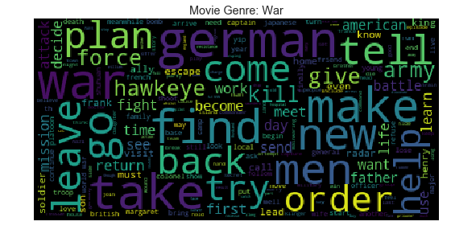

# Movie-Genre-Multi-Label-Text-Classification

In this project, we predict all the genres (up to 27 genres) that a movie can be classified into based on the plot. The data set is obtained from IMDB and contains plot and the genre information of 117194 movies. This is a multi-label classification problem. The below figure plots the number of genres each movie is classified into in the data set. There are movies which fall under 12 genres!

Below are wordcloud plots for Thriller, Sport and War based genre movies. Notice the words used in describing the plots for the respective genres - `murder, kill, victim, death` for Thriller, `team, game, vs, match` for Sports and `german, army, american, mission` for War.  

  

    
  

  

    
  

  

    
  

