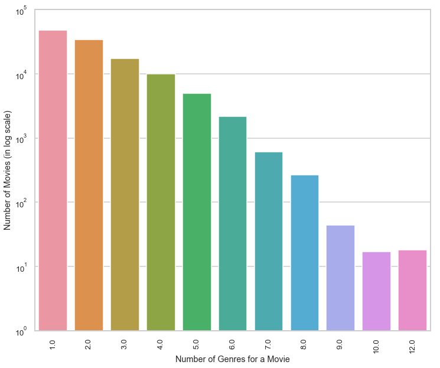
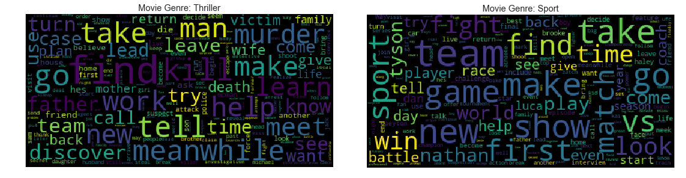
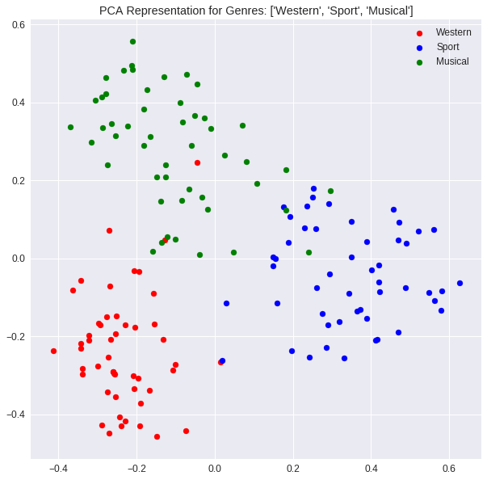

# Movie-Genre-Multi-Label-Text-Classification

In this project, we predict all the genres (up to 27 genres) that a movie can be classified into based on the plot. The data set is obtained from IMDB and contains plot and the genre information of 117194 movies. This is a multi-label classification problem. The below figure plots the number of genres each movie is classified into in the data set. There are movies which fall under 12 genres!

The word cloud plots for genres give ideas on the commonly used words used while describing the plots. For example, the words used in describing the plots for different genres - `murder, kill, victim, death` for Thriller and `team, game, vs, match` for Sports (as one would expect) 

Few techniques used to classify the movies into various plots
* **Binary Relevance**: This consists of fitting one classifier per class. For each classifier, the class is fitted against all the other classes - hence n_classes classifiers are needed. The union of all classes that were predicted is taken as the multi-label output.

* **Label Powerset**: In this approach, we transform the multi-label problem to a multi-class problem with 1 multi-class classifier trained on all unique label (genre) combinations found in the training data. Each plot in the test data set is classified into one of these unique combination. Worst case, there can be 2ngenres classes 

* **Label Powerset with Clustering**: Since 2ngenres can get exponentially high with the number of genres, here we use clustering technique to reduce the number of possible classes into a manageable number. 

* **Sentence Embedding**: Using Transfer Learning techniques and Googles Universal Sentence Encoder, every plot is converted into a 512 length vector. This embedding vector is used to train models and make predictions. Below scatter plot shows the embedded vectors for `Western, Sports` and `Musical` genres where each point corresponds to a 512 length vector (representing one movie plot) which is reduced to 2-D via PCA for visualization. We can see clearly see how these 3 genres have been clustered separately indicating that the theme of the plots for these genres are significantly different

